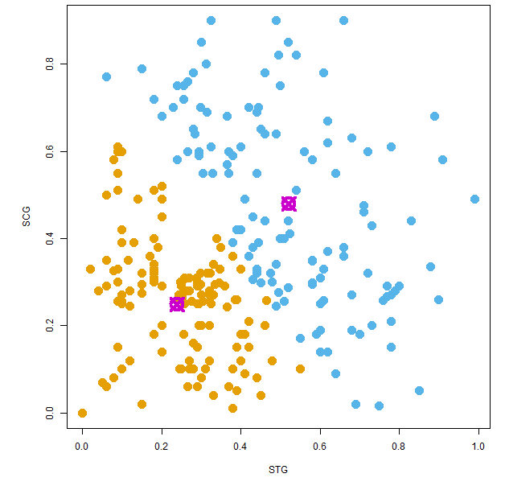

## User Knowledge Modeling
### Using K-means Clustering
---
https://eg7649.shinyapps.io/developingDataProducts  
          
<span style="color:orange">SEAN HUANG</span>  

--- .

## What does it do?

* This simple app aims to provide a <span style="color:yellow">**visual tool**</span> for showing result of <span style="color:yellow">**k-means altorithm**</span>.
* You can assign two attributes from datasets as well as cluster number you prefer.
* Server will do the calculation based on the attributes and cluster number you choose, and show you the result on a 2-dimention plot.

--- .class #id 

## User Knowledge Modeling Dataset?
* It is the real dataset about the students' knowledge status about the subject of Electrical DC Machines. The dataset had been obtained from Ph.D. Thesis.  

* Attribute information
    <font size=5>
    + *STG: The degree of study time for goal object materails*
    + *SCG: The degree of repetition number of user for goal object materails*
    + *STR: The degree of study time of user for related objects with goal object*
    + *LPR: The exam performance of user for related objects with goal object*
    + *PEG: The exam performance of user for goal objects*
    + *UNS: The knowledge level of user (output)*
    
    </font>
    
* You can download the dataset [here](https://archive.ics.uci.edu/ml/datasets/User+Knowledge+Modeling).

--- .class #id

## How does it work?
1. User select two attributes and cluster number
2. UI pass it to server as parameters for kmeans calculation
3. Draw a coloful plot accroding to the result
4. Return the plot to the page so user can see what it will be according to his choice


```r
shinyServer(function(input, output, session) {
  selectedData <- reactive({
    data[, c(input$xcol, input$ycol)] }) # select data accroding to user input
  clusters <- reactive({
    kmeans(selectedData(), input$clusters) }) # do the calculation
  output$plot1 <- renderPlot({ # print colorful result
    par(mar = c(5.1, 4.1, 0, 1))
    plot(selectedData(), col = clusters()$cluster, pch = 20, cex = 3)
    points(clusters()$centers, pch = 13, cex = 3, lwd = 4, col = "#CC00CD") })
})
```


--- &twocol 

## What will you see?


*** =left
Choose STG vs. STR  
4 cluster

```r
selectedData <- data[, c(1,3)]
clusters <- kmeans(selectedData, 4)
par(mar = c(5.1, 4.1, 0, 1))
plot(selectedData, col = clusters$cluster, pch = 20, cex = 3)
points(clusters$centers, pch = 13, cex = 3, lwd = 4, col = "#CC00CD") 
```

 

# 


*** =right
Choose SCG vs. STR  
2 cluster

```r
selectedData <- data[, 2:3]
clusters <- kmeans(selectedData, 2)
par(mar = c(5.1, 4.1, 0, 1))
plot(selectedData, col = clusters$cluster, pch = 20, cex = 3)
points(clusters$centers, pch = 13, cex = 3, lwd = 4, col = "#CC00CD") 
```

 
# 


